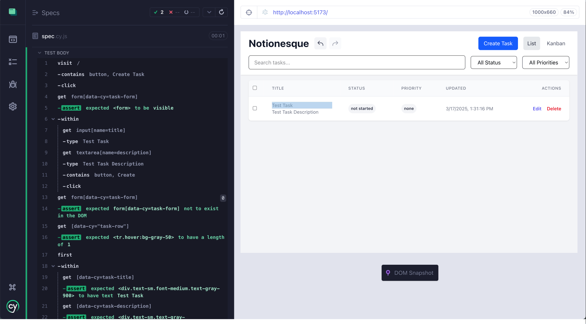
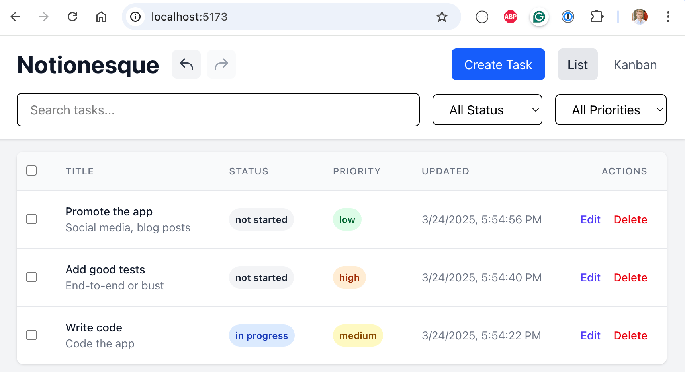
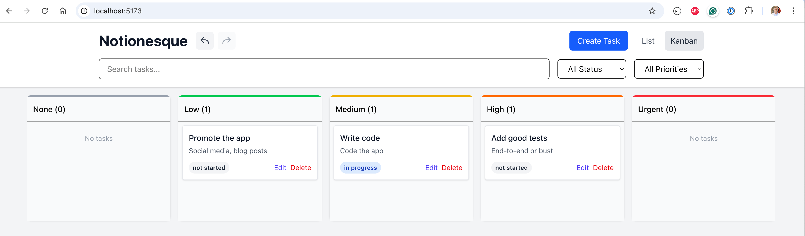

# cursor-ai-example

> Writing E2E tests with Cursor AI help example application

Original application forked from [johnobriendev/notionesque](https://github.com/johnobriendev/notionesque).

## The list view

This application has a modern look and feel and shows each task item in the List view

## The Kanban view

You can also see the tasks arranged by priority in the Kanban view that supports drag-and-drop

## App features

- Modern React + Redux + Vite bundler
- persistence in the local storage
- undo and redo feature
